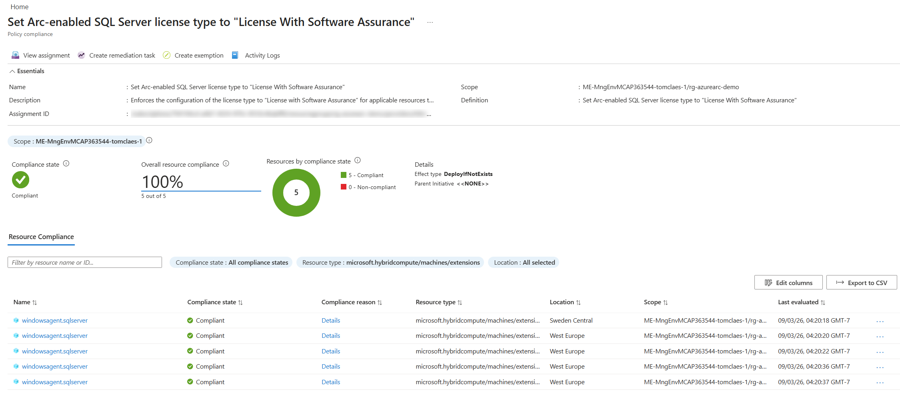
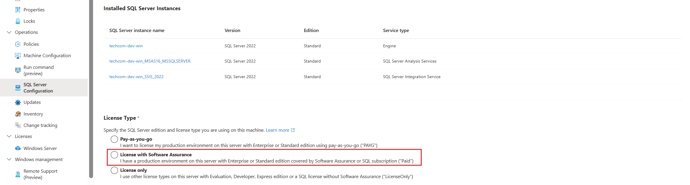
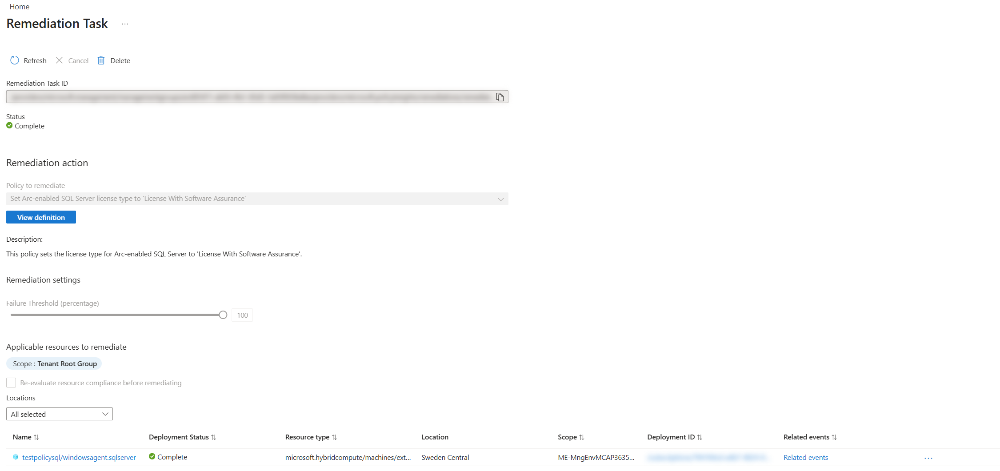
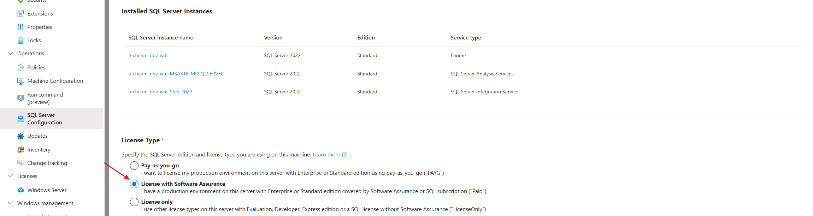

# Arc-enabled SQL Server license type configuration with Azure Policy

This repo deploys and remediates a custom Azure Policy that configures and enforces Arc-enabled SQL Server extension `LicenseType` to a selected target value (for example `Paid` or `PAYG`).

## What Is In This Repo

- `policy/azurepolicy.json`: Custom policy definition (DeployIfNotExists).
- `scripts/deployment.ps1`: Creates/updates the policy definition and policy assignment.
- `scripts/start-remediation.ps1`: Starts a remediation task for the created assignment.
- `docs/screenshots/`: Visual references.

## Prerequisites

- PowerShell with Az modules installed (`Az.Resources`).
- Logged in to Azure (`Connect-AzAccount`).
- Permissions to create policy definitions/assignments and remediation tasks at target scope.

## Deploy Policy

Parameter reference:

| Parameter | Required | Default | Allowed values | Description |
|---|---|---|---|---|
| `ManagementGroupId` | No | Tenant root group | Any valid management group ID | Scope where the policy definition is created. Defaults to the tenant root management group when not specified. |
| `ExtensionType` | No | `Both` | `Windows`, `Linux`, `Both` | Targets the Arc SQL extension platform. When `Both` (default), a single policy definition and assignment covers both platforms. When a specific type is selected, the naming and scope are tailored to that platform. |
| `SubscriptionId` | No | Not set | Any valid subscription ID | If provided, policy assignment scope is the subscription. |
| `TargetLicenseType` | Yes | N/A | `Paid`, `PAYG` | Target `LicenseType` value to enforce. |
| `LicenseTypesToOverwrite` | No | All | `Unspecified`, `Paid`, `PAYG`, `LicenseOnly` | Select which current license states are eligible for update. Use `Unspecified` to include resources with no `LicenseType` configured. |

Definition and assignment creation:

1. Download the required files.

```powershell
# Optional: create and enter a local working directory
mkdir sql-arc-lt-compliance
cd sql-arc-lt-compliance
```

```powershell
$baseUrl = "https://raw.githubusercontent.com/microsoft/sql-server-samples/master/samples/manage/azure-arc-enabled-sql-server/compliance/arc-sql-license-type-compliance"

New-Item -ItemType Directory -Path policy, scripts -Force | Out-Null

curl -sLo policy/azurepolicy.json "$baseUrl/policy/azurepolicy.json"
curl -sLo scripts/deployment.ps1 "$baseUrl/scripts/deployment.ps1"
curl -sLo scripts/start-remediation.ps1 "$baseUrl/scripts/start-remediation.ps1"
```

> **Note:** On Windows PowerShell 5.1, `curl` is an alias for `Invoke-WebRequest`. Use `curl.exe` instead, or run the commands in PowerShell 7+.

2. Login to Azure.

```powershell
Connect-AzAccount
```

```powershell
# Example: target both platforms (default), using tenant root management group
.\scripts\deployment.ps1 -SubscriptionId "<subscription-id>" -TargetLicenseType "PAYG" -LicenseTypesToOverwrite @("Paid")

# Example: target both platforms with explicit management group
.\scripts\deployment.ps1 -ManagementGroupId "<management-group-id>" -SubscriptionId "<subscription-id>" -TargetLicenseType "PAYG" -LicenseTypesToOverwrite @("Paid")

# Example: target only Linux
.\scripts\deployment.ps1 -ExtensionType "Linux" -SubscriptionId "<subscription-id>" -TargetLicenseType "PAYG" -LicenseTypesToOverwrite @("Paid")
```
The first example (without `-ExtensionType`) will:
* Create/update a single policy definition and assignment covering **both** Windows and Linux.
* Assign that policy at the specified subscription scope.
* Enforce LicenseType = PAYG.
* Update only resources where current `LicenseType` is `Paid`.

The second example creates a Linux-specific definition and assignment, with platform-tailored naming.

Scenario examples:

```powershell
# Target Paid, both Linux and Windows, but only for resources with missing LicenseType or LicenseOnly (do not target PAYG)
.\scripts\deployment.ps1 -TargetLicenseType "Paid" -LicenseTypesToOverwrite @("Unspecified","LicenseOnly")

# Target PAYG, but only where current LicenseType is Paid (do not target missing or LicenseOnly)
.\scripts\deployment.ps1 -ExtensionType "Linux" -TargetLicenseType "PAYG" -LicenseTypesToOverwrite @("Paid")

# Overwrite all known existing LicenseType values (Paid, PAYG, LicenseOnly), but not missing
.\scripts\deployment.ps1 -ExtensionType "Linux" -TargetLicenseType "Paid" -LicenseTypesToOverwrite @("Paid","PAYG","LicenseOnly")
```

Note: `scripts/deployment.ps1` automatically grants required roles to the policy assignment managed identity at assignment scope, preventing common `PolicyAuthorizationFailed` errors during DeployIfNotExists deployments.

## Start Remediation

Parameter reference:

| Parameter | Required | Default | Allowed values | Description |
|---|---|---|---|---|
| `ManagementGroupId` | No | Tenant root group | Any valid management group ID | Used to resolve the policy definition/assignment naming context. Defaults to the tenant root management group when not specified. |
| `ExtensionType` | No | `Both` | `Windows`, `Linux`, `Both` | Must match the platform used for the assignment. When `Both` (default), remediates the combined assignment. |
| `SubscriptionId` | No | Not set | Any valid subscription ID | If provided, remediation runs at subscription scope. |
| `TargetLicenseType` | Yes | N/A | `Paid`, `PAYG` | Must match the assignment target license type. |
| `GrantMissingPermissions` | No | `false` | Switch (`present`/`not present`) | If set, checks and assigns missing required roles before remediation. |

```powershell
# Example: remediate both platforms (default), using tenant root management group
.\scripts\start-remediation.ps1 -SubscriptionId "<subscription-id>" -TargetLicenseType "PAYG" -GrantMissingPermissions

# Example: remediate with explicit management group
.\scripts\start-remediation.ps1 -ManagementGroupId "<management-group-id>" -SubscriptionId "<subscription-id>" -TargetLicenseType "PAYG" -GrantMissingPermissions

# Example: remediate only Linux
.\scripts\start-remediation.ps1 -ExtensionType "Linux" -SubscriptionId "<subscription-id>" -TargetLicenseType "PAYG" -GrantMissingPermissions
```

## Managed Identity And Roles

The policy assignment is created with `-IdentityType SystemAssigned`. Azure creates a managed identity on the assignment and uses it to apply DeployIfNotExists changes during enforcement and remediation.

Required roles:

- `Azure Extension for SQL Server Deployment` (`7392c568-9289-4bde-aaaa-b7131215889d`)
- `Reader` (`acdd72a7-3385-48ef-bd42-f606fba81ae7`)
- `Resource Policy Contributor` (required so DeployIfNotExists can create template deployments)

## Troubleshooting

If you see `PolicyAuthorizationFailed`, the policy assignment identity is missing one or more required roles at assignment scope (or inherited scope), often causing missing `Microsoft.HybridCompute/machines/extensions/write` permission.

Use one of these options:

- Re-run `scripts/deployment.ps1` (default behavior assigns `Resource Policy Contributor` automatically).
- Re-run `scripts/deployment.ps1` (default behavior assigns required roles automatically).
- Run `scripts/start-remediation.ps1 -GrantMissingPermissions` (checks and assigns missing required roles before remediation).

## Screenshots




